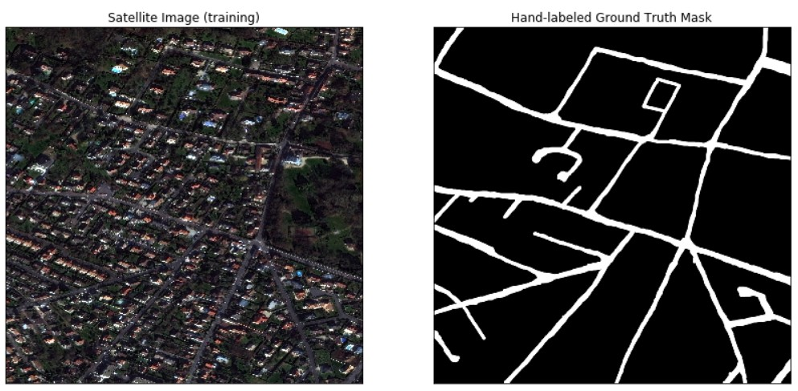
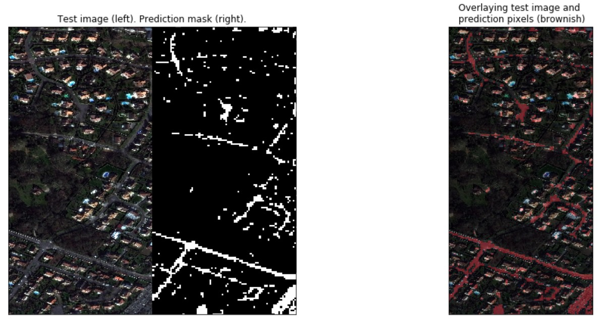

# Road Detection with Logistic Regression

In this notebook, I attempt to identify road pixels in satellite imagery by training a Logistic Regression model. For some good research papers using more elaborate models see [Mnih and Hinton 2010](http://www.cs.toronto.edu/~fritz/absps/road_detection.pdf), [Wang et al 2016](http://www.mdpi.com/2220-9964/5/7/114/htm#B4-ijgi-05-00114), [Zhang et al 2017](https://arxiv.org/pdf/1711.10684.pdf).  

**Folder Structure:** The folder structure to run RoadDetection.ipynb is as follows
```
RoadDetection
│   RoadDetection.ipynb
│
└───data
│   │   
│   └───testing
│   │      RGB-Y.tif
│   │
│   └───training
│   │   │
│   │   └───groundtruth
│   │   │      gt.png
│   │   │   
│   │   └───images
│   │   │      RGB-X.tif

```

**Data:** To train/test the model, I have two overhead 8-bit Red-Green-Blue (RGB) satellite images. Labeled data is not provided.

**Ground Truths/Labels:** Supervised machine learning algorithms rely on ground truth labels to train models. In our case, the ideal ground truths at the pixel-level are binarized versions of the training images where every pixel corresponding to a road is set to white (foreground) and the rest is set to black (background). Since I do not know where the training image is geographically located, I cannot use open source data with geolocation information about existing roads (such as GeoJSON labels) to infer the pixel mask. Thus, I hand-labeled the data using photoshop to paint over the roads in the training image. Sometimes, it was hard for me to distinguish between roads and driveways. Moreover, due to natural hand jitters, it was impossible to paint over all the road pixels without introducing errors. To mitigate some of these errors, I applied smoothing mean/gaussian filters and morphological transformations such as erosion/dilation to get the final mask. Though the hand-labeling process was not perfect, the mask looked reasonable enough (as shown below) for me to use it as the ground truth.



**Metrics:** The most common metrics for evaluating road detection systems are precision and
recall, since typically the datasets are imbalanced (most of the planet is not made of roads). It is also common to use the harmonic average of the two, that is, the F1 score. A disadvantage of the F1 score is that it penalizes thickness, so it does not incentivize road network connectivity (a better metric in this case would be the Average Path Length Similarity). Since we do not care about road connectivity in this notebook, we will stick to simple metrics like accuracy and F1 when validating our model.   

**Models/Methods:** The standard approach to classify road pixels is by including information about each pixel's context (i.e. the surrounding pixels). This way the model can mitigate occlusions by cars, trees, etc. I used a sliding 16X16 box around each pixel to be classified. I classified a block as a 1 if the mean value of the ground truth pixels in the block is greater than a threshold (0.25), 0 otherwise. The model I used for the classification task was logistic regression with a polynomial basis of degree 4.

**Results:** Below are the predictions using logistic regression



We see that most of the predicted road pixels are actually on top of the roads in the test image but that the classifier misses many road pixels (precision is better than recall).  

**Outlook:** As next steps, I would: 
* Use a more complex model architecture (like convolutionnal neural networks).
* Get more data by using data augmentation (rotations, flips)
